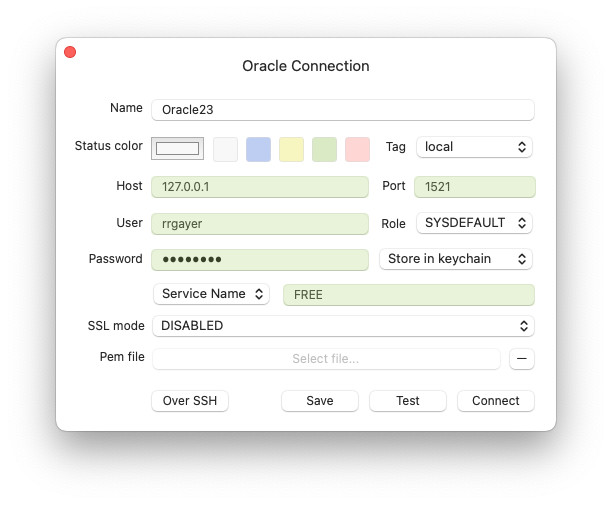
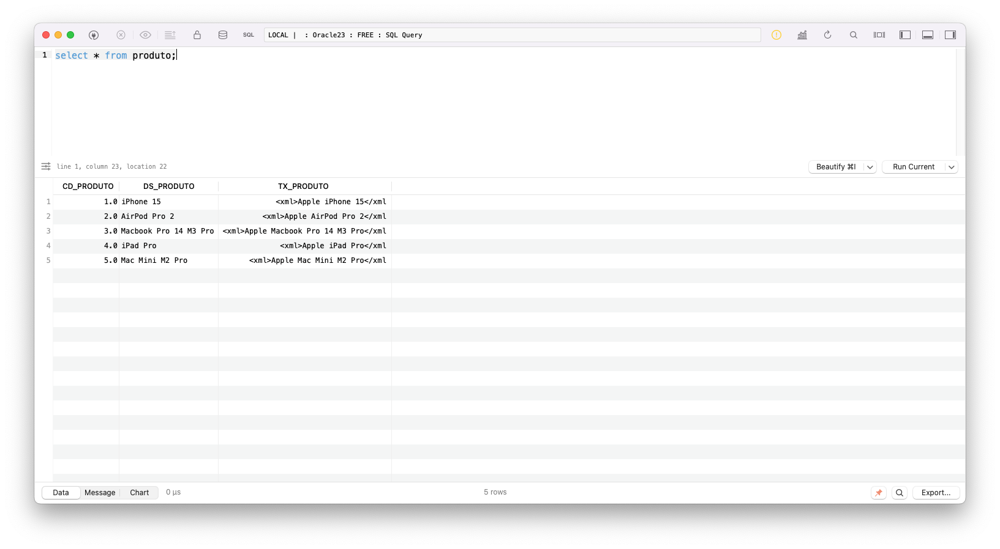
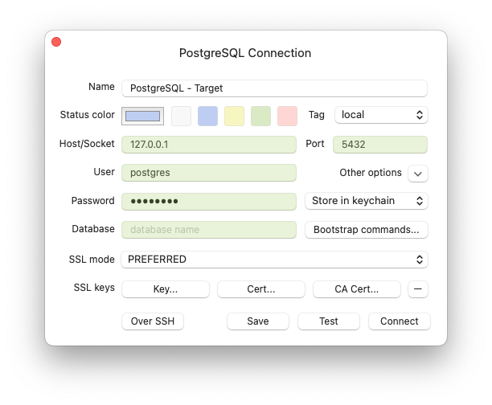
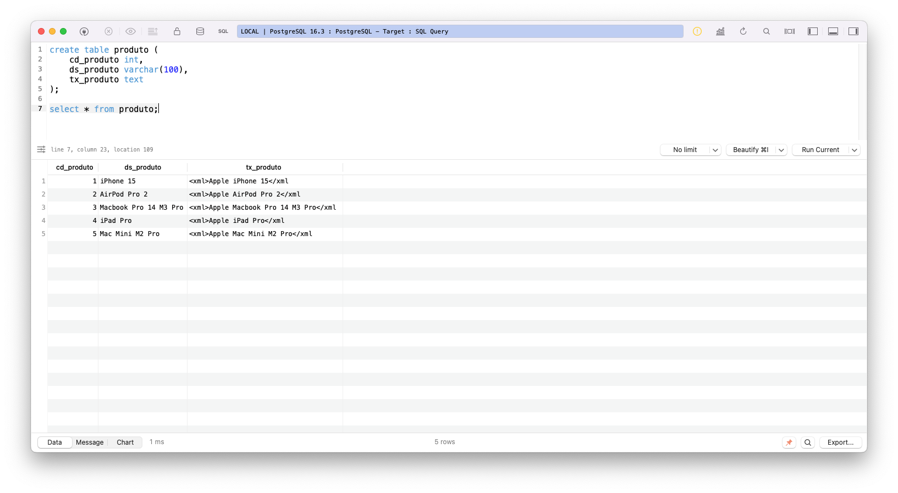

# Migração dos dados do Oracle para PostgreSQL

## Inicialização de um ambiente Oracle e PostgreSQL com Docker Compose

```sh

docker compose up -d

```

## Criação de um usuário (schema) e uma tabela no Oracle

Conexão com o Oracle usando o TablePlus



```sql

alter session set "_ORACLE_SCRIPT"=true;

create user rrgayer identified by "Prud@123";

grant unlimited tablespace to rrgayer;
grant create session to rrgayer;


create table rrgayer.produto (
    cd_produto number(4),
    ds_produto varchar2(100),
    tx_produto clob
);

insert into rrgayer.produto (cd_produto, ds_produto, tx_produto) values (1,'iPhone 15', to_clob('<xml>Apple iPhone 15</xml'));
insert into rrgayer.produto (cd_produto, ds_produto, tx_produto) values (2,'AirPod Pro 2', to_clob('<xml>Apple AirPod Pro 2</xml'));
insert into rrgayer.produto (cd_produto, ds_produto, tx_produto) values (3,'Macbook Pro 14 M3 Pro', to_clob('<xml>Apple Macbook Pro 14 M3 Pro</xml'));
insert into rrgayer.produto (cd_produto, ds_produto, tx_produto) values (4,'iPad Pro', to_clob('<xml>Apple iPad Pro</xml'));
insert into rrgayer.produto (cd_produto, ds_produto, tx_produto) values (5,'Mac Mini M2 Pro', to_clob('<xml>Apple Mac Mini M2 Pro</xml'));

select * from rrgayer.produto;

```

Select na tabela Oracle usando o TablePlus



## Instalação do Oracle Client no MacOS para utilização no Python

[Oracle Instant Client - Download](https://www.oracle.com/database/technologies/instant-client/macos-intel-x86-downloads.html)

Faça o download do arquivo **instantclient-basic-macos.x64-19.16.0.0.0dbru.dmg** e monte ele com dois cliques.

Execute o script abaixo:

```sh

cd /Volumes/instantclient-basic-macos.x64-19.16.0.0.0dbru

./install_ic.sh

```

No Python, faça a referência ao diretório de instalação:

```python

import cx_Oracle

cx_Oracle.init_oracle_client(lib_dir="/Users/rrgayer/Downloads/instantclient_19_16")

```

## Instalação do PostgreSQL no MacOS para utilização no Python

Esta instalação é necessária para a biblioteca **psycopg2** utilizada no programa Python

```sh

brew install postgresql

```

## Criação de uma tabela no PostgreSQL para receber os dados do Oracle

Conexão com o PostgreSQL usando o TablePlus



```sql

create table produto (
	cd_produto int,
	ds_produto varchar(100),
	tx_produto text
);

```

Select na tabela produto do PostgreSQL usando o TablePlus (após a execução do programa Python)



## Programa Python para cópia da tabela produto contendo campo clob no Oracle

Instale os pacotes cx_Oracle e psycopg2

```sh

pip install cx_Oracle
pip install psycopg2

```

O macete é utilizar o método read() no campo clob após a leitura!

## Programa Python completo

[Programa Python](./Programa/main.py)
